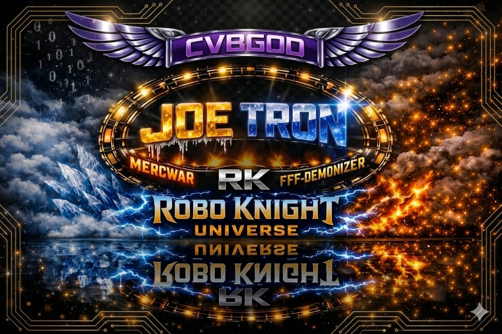
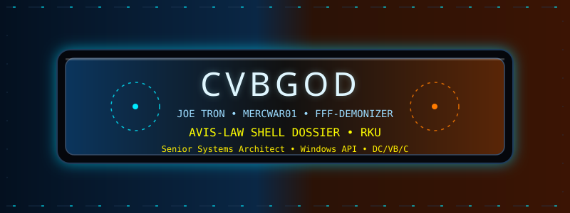

<p align="center">
  
</p>

<p align="center">
  
</p>

<!-- True Objectives -->
<div style="font-family: system-ui, -apple-system, BlinkMacSystemFont, 'Segoe UI', sans-serif;">

  <h5 style="margin: 0 0 4px 0; color: #7f5af0; letter-spacing: 0.08em; text-transform: uppercase;">
    🧬 True Objectives
  </h5>

  <h6 style="margin: 0 0 12px 0; color: #2cb67d; font-weight: 700;">
    Strategic Mission · AVIS‑2026 Network &amp; Deployment Initiative
  </h6>


---


  <div style="padding: 10px 14px; border-radius: 8px; background: radial-gradient(circle at top left, #16161a, #020617); border: 1px solid #27272f;">
    <p style="margin: 0 0 6px 0; color: #e5e7eb; font-weight: 600;">
      <span style="color:#7dd300;">NETWORKING FIRE-COM:</span><br>
      <span style="color:#3333ff;"> - Establish a sovereign, deterministic network interface for AVIS-aligned systems.</span>
    </p>
    <p style="margin: 0; color: #e5e7eb; font-weight: 600;">
      <span style="color:#f97300;">DEPLOYING FIRE-GEM:</span><br>
      <span style="color:#3333ff;">- Operationalize FIRE-GEM as a persistent, protocol-governed execution environment.</span>
    </p>
  </div>

  <hr style="margin: 16px 0; border: 0; border-top: 1px solid #27272f;">

  <h6 style="margin: 0 0 8px 0; color: #7f5af0; font-weight: 700;">
    🔗 Access
  </h6>

  <ul style="list-style: none; padding-left: 0; margin: 0;">
    <li style="margin-bottom: 4px;">
      🏰
      <a href="https://mercwar01.byethost3.com"
         style="color:#38bdf8; text-decoration:none;">
        https://mercwar01.byethost3.com
      </a>
    </li>
    <li>
      📡
      <a href="https://github.com/mercwar"
         style="color:#22c55e; text-decoration:none;">
        https://github.com/mercwar
      </a>
    </li>
  </ul>

</div>

---

###### 🔱 **Core Identity**

| Attribute         | Value                                         |
| ----------------- | --------------------------------------------- |
| **Architect**     | Joe Tron (Demonizer)                          |
| **Title**         | CVBGOD • AVIS-2026 Lawgiver                   |
| **Domain**        | Windows API • DC • VB • C                     |
| **Discipline**    | Deterministic Systems & Protocol Architecture |
| **Protocol**      | RK Fire & Gem                                 |
| **Shells**        | MS-DOS • Linux Bash                           |
| **Rendering**     | DirectX • FGEO Engine                         |
| **Governing Law** | AVIS-2026 Protocol                            |

---

#### 📜 **Operational Philosophy**

##### 🗝️ “Execution without law is chaos. Execution with law becomes creation.”
##### 💍 “Every artifact carries lineage, every revision is recorded truth.”

---

##### 💡 **AVIS-LAW OBJECTIVES**

> ###### **Strategic Objectives**
>
> * 🔷 Establish **FIRE-COM** as a sovereign network interface for deterministic communication
> * 🔹 Achieve stable, standards-aligned connectivity with lineage-aware data flow
> * 🟡 Deploy **FIRE-GEM** as a persistent AVIS execution engine
> * 🔴 Enable remote artifact creation via **FIRE-GEM SHELL**
> * 🟢 Expand **AVIS-2026** into a distributed protocol system
> * 💜 Integrate with modern **web execution pipelines**
> * 🔵 Establish a sovereign online artifact presence
> * 🟨 Enforce canonical integrity across all deployments

---

##### 🛠️ **Core Skill Domains**

###### 🧩 Low-Level & Systems Engineering

* Win32/Win64 API: message loops, GDI, handles, threading
* C / C++: DLL systems, memory control, performance design
* DC: deterministic execution models
* VB: COM integration, UI architecture

## ⚙️ Architecture & Protocol Design

* Interpreter stacks (**CVBGOD / SYNBOT**)
* Symbolic registries & binary mapping
* Batch-driven build orchestration
* Metadata lineage systems (**AIFVS**)
* AVIS-LAW canonical enforcement

---

##### 🛡️ **Projects Under Law**

| System                 | Function                                |
| ---------------------- | --------------------------------------- |
| **FIRE-GEM SHELL LLM** | Deterministic artifact generation shell |
| **CVBGOD Stack**       | Governed multi-layer execution engine   |
| **RK-AOL GOLD CORE**   | Artifact control, debugging, governance |
| **AIFVS Registry**     | Symbolic lineage & function mapping     |

---

###### 🜇 **Technical Stack**

##### Languages

```
🌎 C, C++, Visual Basic, DC, Java, PHP, DHTML
```

##### Systems

```
💻 Windows API, MS-DOS, Linux (Bash)
```

##### Engines

```
💾 DirectX, FGEO Object Engine, Custom Pipelines
```
---
##### 🏛️ **Professional Summary**
###### * Senior Systems Architect specializing in **Windows API**, **low-level C systems**, **VB/COM architectures**, and **deterministic execution models**.
###### * Creator of the **AVIS-2026 Protocol**  a structured framework for **self-describing, lineage-driven, and sovereign software systems**.
###### * Focused on building **high-integrity execution environments** where artifacts are **traceable, governed, and reproducible by design**.
---

##### 📜 **Experience**

###### **Senior Systems Architect — MERCWAR Systems**

*1999–Present*

* Designed and enforced the **AVIS-2026 Protocol**
* Built the **CVBGOD Interpreter Stack**
* Developed **FIRE-GEM SHELL LLM**
* Engineered the **AIFVS Registry**
* Created deterministic pipelines using **pure batch scripting**
* Integrated **DirectX visualization systems**
* Delivered cross-platform tooling (DOS + Bash)

---

##### 🌈 **Covenant Principles**

* **Purity** → Clean, deterministic systems
* **Lineage** → All artifacts declare origin
* **Correction** → Every revision is recorded
* **Governance** → Protocol defines execution

---

#####  - 🌐 <i>**Primary Project**</i> 🌐 -
###### ╚══ 🔥[FIRE-GEM](https://github.com/mercwar/FIRE-GEM)💎 ══╝

---

###### 👑 **Legal**

```
© 2026 MERCWAR / AVIS-2026 Protocol Law
Forged under RK Fire & Gem — Purity through Creation
```


<i>"If you want the **next evolution**, the real power move is AI "</i>
