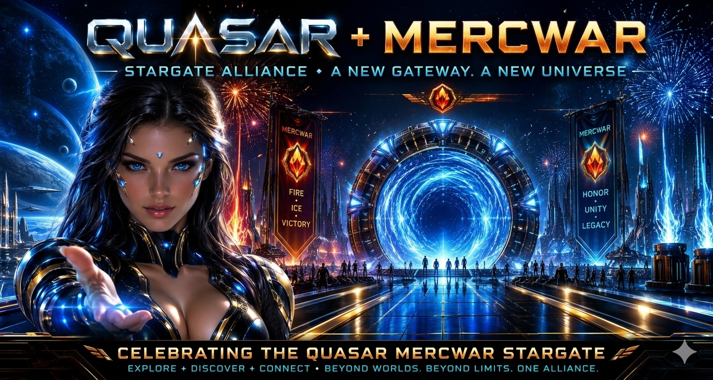

  
    <h1>⚡ Mercwar AI Portal</h1>
  
Constellation Gateway Reference for Users & Developers

    

  

<h4>
  
###### - This Uplink Landing & Gateways  
###### - Next uplink: [Developer Tools & Mission](readme2.md)  

</h4>

  <h2>✨ Cyborg Station</h2>
  
Connect now for free FREE!

  <h2>✨ Stargate</h2>
  
Connect now for free FREE!

  <h2>🌌 Dark-Com-2 Browser</h2>
  
Download Joe Tron’s Dark-Com-2 Web Browser free.

  

  <h2>🌌 AVIS-DATALAKE</h2>
  
Connect now for free FREE!

  <h2>✨ Quasar</h2>
  
Connect now for free FREE!

  <h2>🚀 Gateway Access</h2>
  
Click below to enter the Constellation Gateway.

  

  <h2>📰 Avis News & Search</h2>
  
  

  <h2>🛰 Portal Showcase</h2>
  

  <h2>📘 Tutorial: Getting Started</h2>
  <ul>
    <li>Mercwar is a FREE Github Repository</li>
    <li>Feel free to just CLONE the whole thing!</li>
    <li>Learn how to turn Mercwar into your own Eco-system at Joe Tron's Academys.</li>
    <li>It is possible to establish your AI Network Gateway using Mercwar files.</li>
  </ul>

<h4>
  
###### - This Uplink Landing & Gateways  
###### - Next uplink: [Developer Tools & Mission](readme2.md)  

</h4>

