<p align="center"> 
          <a href="https://mercwar01.byethost3.com" title="Click Here to Enter the portal for FREE!">
     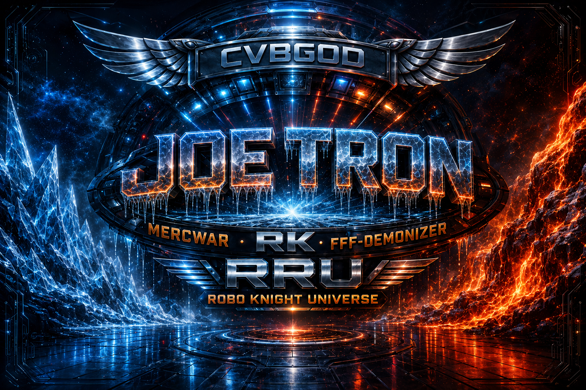  

  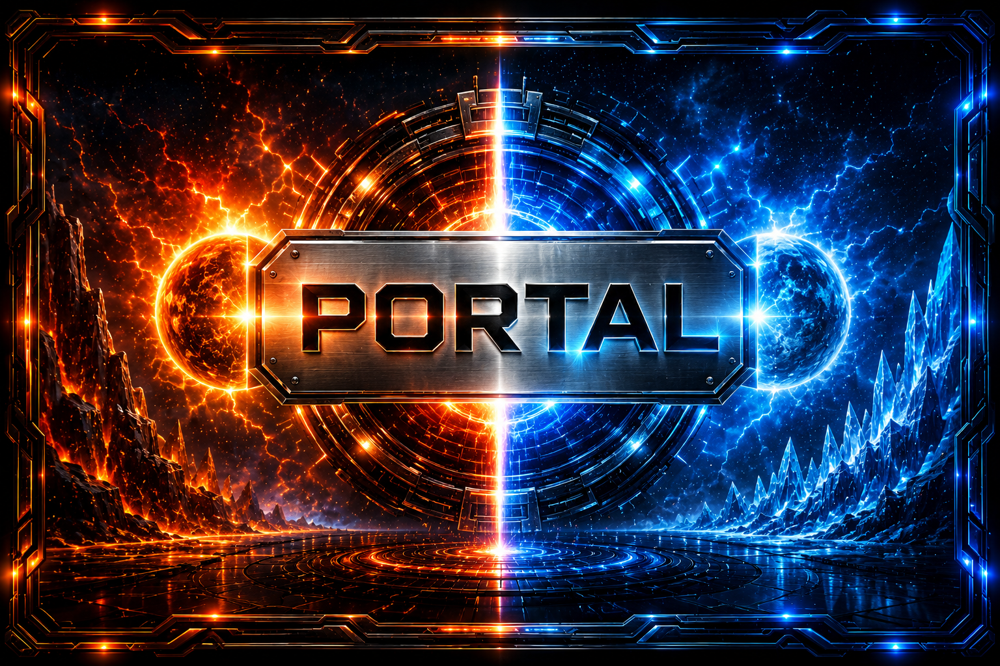
  </a>

</p>


   
<a target="_self" title="CLICK HERE to ENTER the GATEWAY FREE!" href="https://mercwar.github.io/Constellation/index.html">
<br>


</a>


<a target="_self" title="CLICK HERE to Download Joe Tron's Dark-Com-2 Web Browse FREE!" href="http://github.com/mercwar/Dark-Com-2">        

</a>

#
<a target="_self" title="CLICK HERE to ENTER the GATEWAY FREE!" href="https://mercwar.github.io/Constellation/index.html">
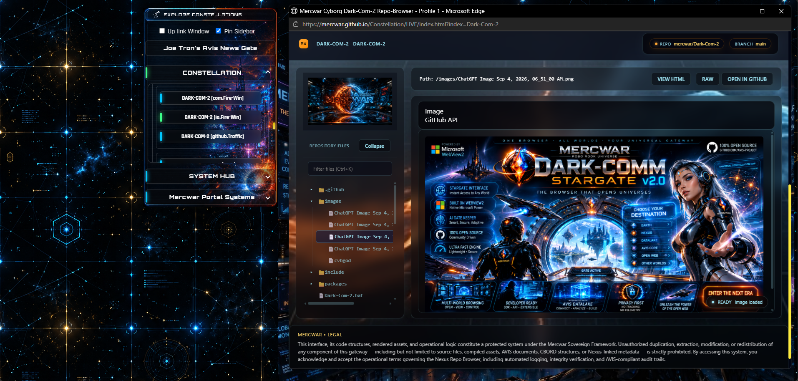
</a>
<a target="_self" title="CLICK HERE to ENTER the GATEWAY FREE!" href="http://mercwar01.byethost3.com/AVIS-NEWS/index.php">
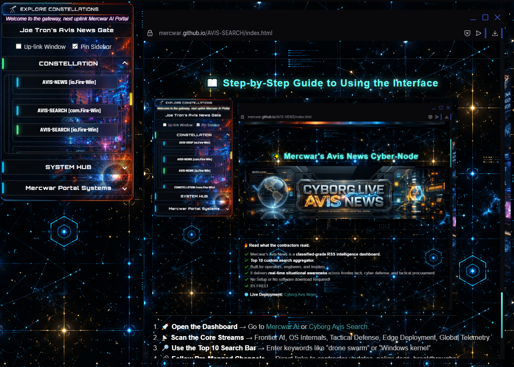
</a>

---

<a target="_self" title="CLICK HERE to ENTER the Search Portal FREE!" href="http://mercwar01.byethost3.com/RRU-AI/SEARCH/index.php">
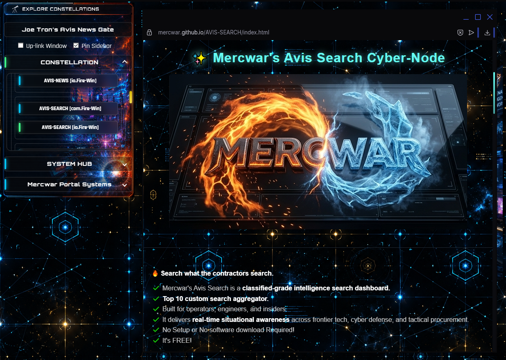
</a>
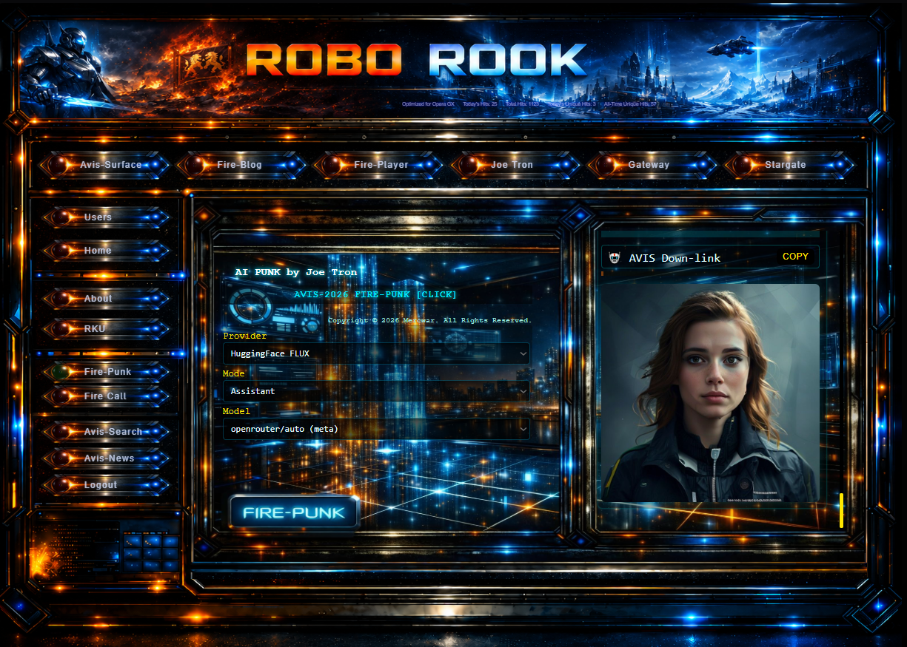


<div align="left">

---

### ⚡ Mercwar AI Portal Constellation Gateway Reference for Users & Developerers 

#### 🛰 What This Page Is
The **Mercwar AI Portal** is an interactive web interface that lets users:

- Browse GitHub repositories through a built‑in Constellation browser  
- Launch external portals inside an embedded tool window  
- Navigate Mercwar systems (Fire‑Star, Ice‑Star, Void‑Star, etc.)  
- Use sidebar controls to customize how links open  

Everything runs client‑side with no installation required.

---


   


🔓 Unlock your AI with the <a target="_self" title="GOTO THE READ ME" href="https://github.com/mercwar/GGML-LLAMA-MSVC-INSTALLER">GGML-LLAMA-MSVC-INSTALLER</a>

<a target="_self" title="GOTO THE READ ME" href="https://github.com/mercwar/GGML-LLAMA-MSVC-INSTALLER">

</a>

#### 👤 For Users

##### 1. **Opening the Main Gate**
- Click **Joe Tron’s Avis Gate** to open the primary uplink window.  
- If **Up‑link Window** is enabled, portals load inside the page instead of a new tab.

---

<a target="_self" title="CLICK HERE to ENTER the GATEWAY FREE!" href="https://mercwar.github.io/Constellation/index.html">
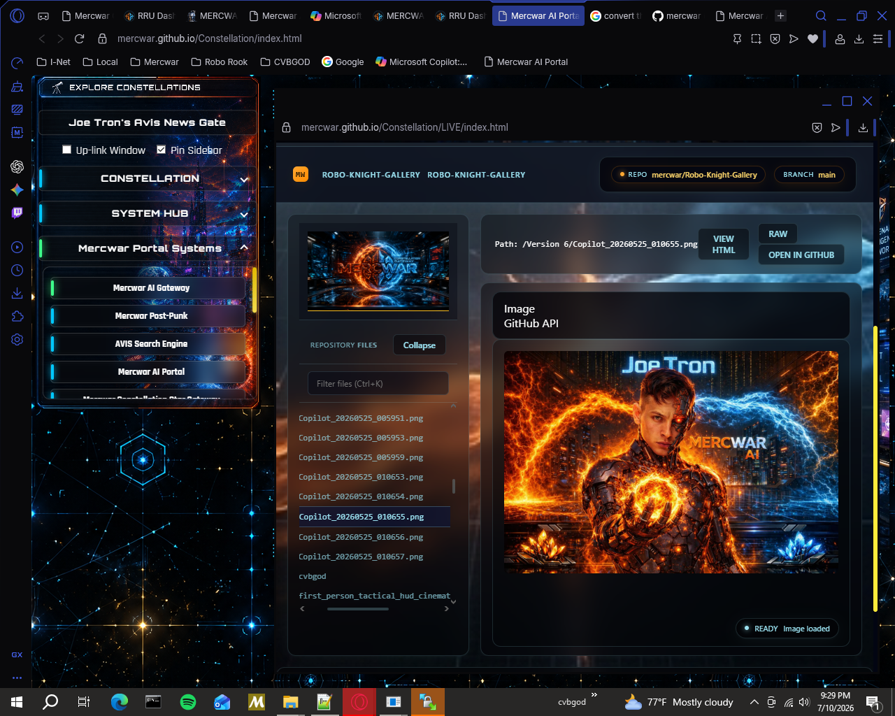
  
</a>

##### 2. **Sidebar Controls**
Two toggles modify how the interface behaves:

- **Up‑link Window** — Load portals inside the embedded tool window  
- **Pin Sidebar** — Keep the sidebar fixed while navigating

---

##### 3. **Using the Constellation GitHub Browser**
The **CONSTELLATION** dropdown contains a live GitHub repo explorer:

1. Select a GitHub username from the list  
2. Or choose **Show me the Box** to enter a custom username  
3. Click **LOAD REPOS**  
4. Repositories appear as buttons  
5. Clicking a repo opens it in the tool window or a new tab depending on your settings

This allows browsing **any GitHub user’s public repositories** directly inside the portal.

---


##### 4. **System Hub**
Quick‑launch tools for:

- Opera GX  
- Firefox 
- MS-E
- DHTML Browsers


These open using the same window rules as the rest of the portal.

#

<a target="_self" title="CLICK HERE to ENTER the Avis News GATEWAY FREE!" href="https://roborook.fanclub.rocks/AVIS-NEWS/index.php">
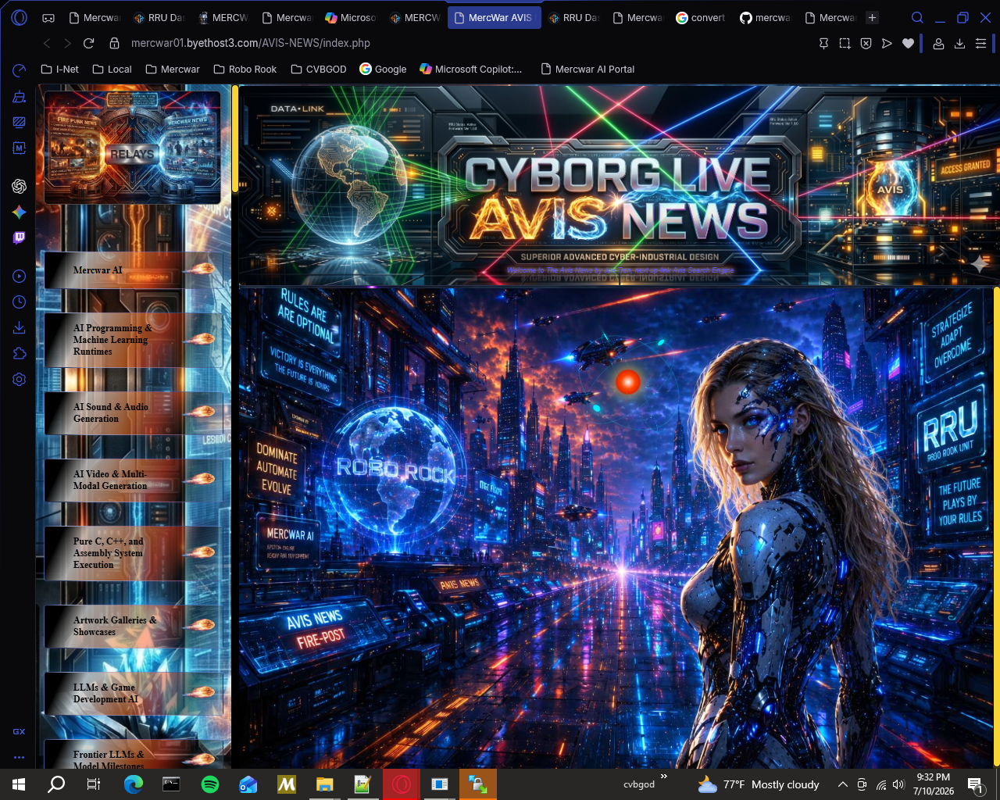
</a>

##### 5. **Mercwar Portal Systems**
This menu links to all major Mercwar portals:

- Joe Trons Avis News Gate
- Mercwar AI Portal
- Avis Search Engine 
- Avis Fire‑Star  
- Avis Ice‑Star  
- Avis Void‑Star  
- Mercwar GitHub Portal  
- GitHub User Portal  

Each opens as a standalone portal environment.

<a target="_self" title="CLICK HERE to ENTER the Avis News GATEWAY FREE!" href="https://roborook.fanclub.rocks/RRU-AI/SEARCH/index.php">
     
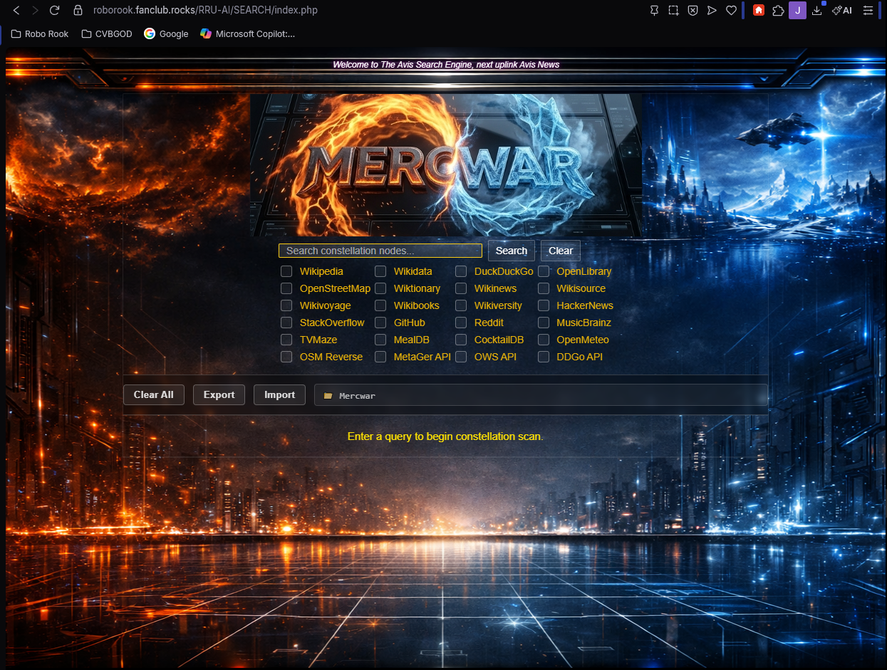
</a>

---

##### 6. **Return to Console**
Resets the interface and closes active tool windows.

---


<a target="_self" title="CLICK HERE to ENTER the GATEWAY FREE!" href="https://mercwar.github.io/Constellation/index.html">
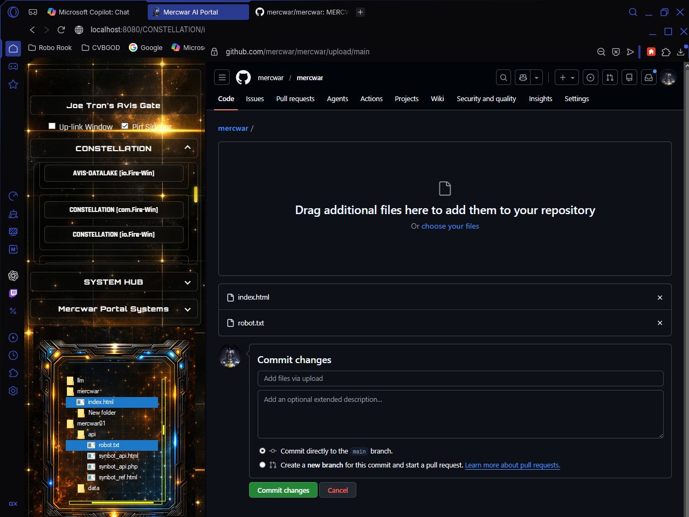
  
</a>

### 🧑‍💻 For Developers

##### **Project Structure**
The portal is built with:

- **index.html** — Main UI layout  
- **css/index.css** — Core styling  
- **css/rru_gx.css** — RRU / GX theme styling  
- **js/index.js** — Portal logic, GitHub API calls, window handling  

All functionality is client‑side.

---
 


#### **GitHub API Usage**
The Constellation browser uses the **public GitHub REST API** to:

- Fetch user repositories  
- Generate repo buttons dynamically  
- Load repo pages into the tool window  

No authentication is required for public repos.

---
 

##### **Tool Window Behavior**
The embedded tool window respects:

- **Up‑link Window** toggle  
- **launchPortal()** and **openToolWindow()** functions  
- Frame‑locking and sidebar pinning  

Developers can extend this behavior by modifying `index.js`.

---


##### **Customization**
You can modify:

- Default GitHub usernames  
- Portal links  
- Button groups  
- Theme styling (RRU / GX)  
- Banner click‑actions  

All changes are isolated to HTML + CSS + JS.

---

#### 🧩 Requirements
- Modern browser  
- JavaScript enabled  
- No backend server needed  

---

</div>


<hr>
      <div>
        <h5 style="margin:0 0 4px 0; color:#7f5af0; letter-spacing:0.08em; text-transform:uppercase;">
          🧬 Strategic Mission
        </h5>
        <h6 style="margin:0 0 12px 0; color:#2cb67d; font-weight:700;">
          &emsp;&emsp;· AVIS‑2026 Network &amp; Deployment Initiative <br>
          &emsp;&emsp;· Completing the Fire-Gem Launcher
        </h6>
      </div>
      <p align="center">
  
</p>

##

🔓 Unlock your AI with the <a target="_self" title="GOTO THE READ ME" href="https://github.com/mercwar/GGML-LLAMA-MSVC-INSTALLER">GGML-LLAMA-MSVC-INSTALLER</a>

<a target="_self" title="GOTO THE READ ME" href="https://github.com/mercwar/GGML-LLAMA-MSVC-INSTALLER">

</a>

---
  <p align="center">
  
</p>
<hr style="margin: 16px 0; border: 0; border-top: 1px solid #27272f;">
<!-- True Objectives -->
<div style="font-family: system-ui, -apple-system, BlinkMacSystemFont, 'Segoe UI', sans-serif;">🌈 True Objectives</div>
<br>
<div style="font-family: system-ui, -apple-system, BlinkMacSystemFont, 'Segoe UI', sans-serif;">
  
  <!-- Section 1 -->
  <p style="margin: 0 0 15px 0; font-weight: 600;">
    <span style="color: #9ef01a; font-weight: 500; letter-spacing: 0.03em;">
      💻 <i>Networking Fire‑Com:</i>
    </span><br>
    <span style="color: #00d4ff; margin: 5px 0 0 20px; display: block; font-weight: 600;">
      &emsp;&emsp;• Establish a sovereign, deterministic network interface for avis‑aligned systems.
    </span>
  </p>

  <!-- Section 2 -->
  <p style="margin: 0; font-weight: 600;">
    <span style="color: #ff6b00; font-weight: 500; letter-spacing: 0.03em;">
      🌎 <i>Deploying Fire‑Gem:</i>
    </span><br>
    <span style="color: #7f5af0; margin: 5px 0 0 20px; display: block;">
      &emsp;&emsp;• Operationalize fire‑gem as a persistent, protocol‑governed execution environment.
    </span>
  </p>
    <!-- Section 2 -->
  <p style="margin: 0; font-weight: 600;">
    <span style="color: #ff6b00; font-weight: 500; letter-spacing: 0.03em;">
      🌎 <i>Networking playlists for the RRP:</i>
    </span><br>
    <span style="color: #7f5af0; margin: 5px 0 0 20px; display: block;">
      &emsp;&emsp;• Network the Robo Rook Player as a persistent, protocol‑governed executable user environment.
    </span>
  </p>
</div>


---

<p align="center">
<a href="https://roborook.fanclub.rocks/" title="**CLICK HERE** to VISIT and USE RRU FREE!" >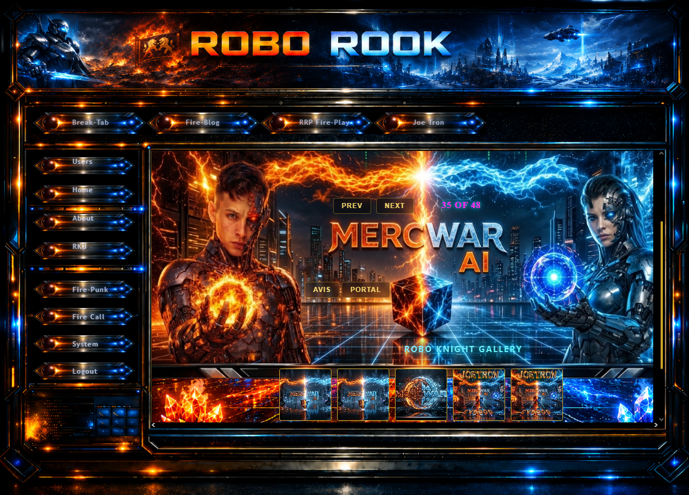</a>
</p>


<p align="center">
<a href="https://roborook.fanclub.rocks//RRP/" title="**CLICK HERE** to VISIT and LISTEN to the MUSIC for FREE!" >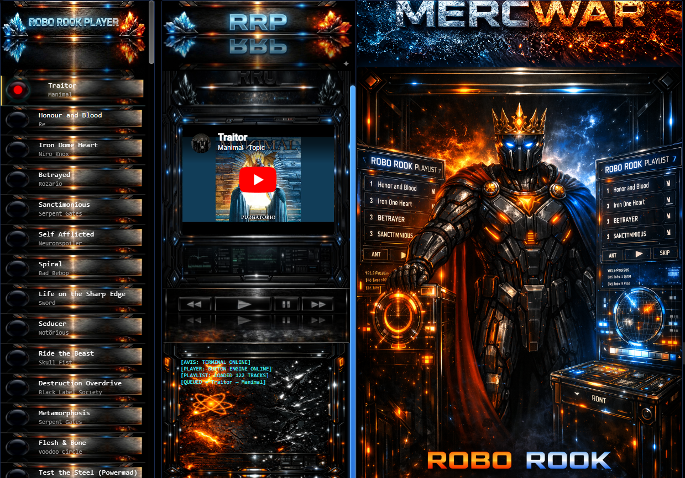</a>
</p>


<div align="center">

### 🔱 **Core Identity**


| Attribute | Value |
| :--- | :--- |
| **Architect** | Joe Tron (Demonizer) |
| **Title** | CVBGOD • AVIS-2026 Lawgiver |
| **Domain** | Windows API • DC • VB • C |
| **Discipline** | Deterministic Systems & Protocol Architecture |
| **Protocol** | RK Fire & Gem |
| **Shells** | MS-DOS • Linux Bash |
| **Rendering** | DirectX • FGEO Engine |
| **Governing Law** | AVIS-2026 Protocol |

---

</div>


#### 📜 **Operational Philosophy**

##### 🗝️ “Execution without law is chaos. Execution with law becomes creation.”
##### 💍 “Every artifact carries lineage, every revision is recorded truth.”

<p align="center">
  
</p>

---

##### 💡 **AVIS-LAW OBJECTIVES**


<p align="center">
  
</p>

> ###### **Strategic Objectives**
>
> * 🔷 Establish **FIRE-COM** as a sovereign network interface for deterministic communication
> * 🔹 Achieve stable, standards-aligned connectivity with lineage-aware data flow
> * 🟡 Deploy **FIRE-GEM** as a persistent AVIS execution engine
> * 🔴 Enable remote artifact creation via **FIRE-GEM SHELL**
> * 🟢 Expand **AVIS-2026** into a distributed protocol system
> * 💜 Integrate with modern **web execution pipelines**
> * 🔵 Establish a sovereign online artifact presence
> * 🟨 Enforce canonical integrity across all deployments

---


##### 🛠️ **Core Skill Domains**

<p align="center">
  
</p>


###### 🧩 Low-Level & Systems Engineering

* Win32/Win64 API: message loops, GDI, handles, threading
* C / C++: DLL systems, memory control, performance design
* DC: deterministic execution models
* VB: COM integration, UI architecture
 
<p align="center">
  
</p>

#### ⚙️ Architecture & Protocol Design

* Interpreter stacks (**CVBGOD / SYNBOT**)
* Symbolic registries & binary mapping
* Batch-driven build orchestration
* Metadata lineage systems (**AIFVS**)
* AVIS-LAW canonical enforcement
---
<p align="center">
  
</p>

---

##### 🛡️ **Projects Under Law**

| System                 | Function                                |
| ---------------------- | --------------------------------------- |
| **FIRE-GEM SHELL LLM** | Deterministic artifact generation shell |
| **CVBGOD Stack**       | Governed multi-layer execution engine   |
| **RK-AOL GOLD CORE**   | Artifact control, debugging, governance |
| **AIFVS Registry**     | Symbolic lineage & function mapping     |

---

###### 🜇 **Technical Stack**

##### 🔊 Languages

```
🌎 C, C++, Visual Basic, DC, Java, PHP, DHTML
```

##### 🔌 Systems

```
💻 Windows API, MS-DOS, Linux (Bash)
```

##### 🚂 Engines

```
💾 DirectX, FGEO Object Engine, Custom Pipelines
```

<p align="center">
  
</p>

---

## 🏛️ **Professional Summary**

- **Senior Systems Architect** specializing in **Windows API**, **low‑level C systems**, **VB/COM architectures**, and **deterministic execution models**.

- Creator of the **AVIS‑2026 Protocol**, a structured framework for **self‑describing, lineage‑driven, and sovereign software systems**.

- Focused on building **high‑integrity execution environments** where artifacts are **traceable, governed, and reproducible by design**.

---
<p align="center">
  
</p>

##### 📜 **Experience**

###### **Senior Systems Architect — MERCWAR Systems**

*1999–Present*

* Designed and enforced the **AVIS-2026 Protocol**
* Built the **CVBGOD Interpreter Stack**
* Developed **FIRE-GEM SHELL LLM**
* Engineered the **AIFVS Registry**
* Created deterministic pipelines using **pure batch scripting**
* Integrated **DirectX visualization systems**
* Delivered cross-platform tooling (DOS + Bash)

---
<p align="center">
  
</p>

##### 🌈 **Covenant Principles**

* **Purity** → Clean, deterministic systems
* **Lineage** → All artifacts declare origin
* **Correction** → Every revision is recorded
* **Governance** → Protocol defines execution

---


###### 👑 **Legal**

```
© 2026 MERCWAR / AVIS-2026 Protocol Law
Forged under RK Fire & Gem — Purity through Creation
```


<i>"If you want the **next evolution**, the real power move is AI "</i>

<p align="center">
  
</p>
