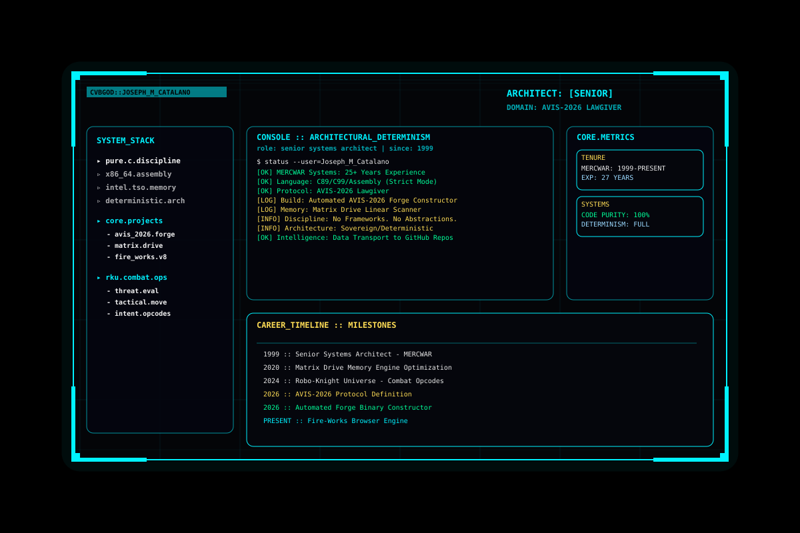

<p align="center">
  
</p>


<hr>
      <div>
        <h5 style="margin:0 0 4px 0; color:#7f5af0; letter-spacing:0.08em; text-transform:uppercase;">
          🧬 Strategic Mission
        </h5>
        <h6 style="margin:0 0 12px 0; color:#2cb67d; font-weight:700;">
          &emsp;&emsp;· AVIS‑2026 Network &amp; Deployment Initiative <br>
          &emsp;&emsp;· Completing the Fire-Gem Launcher
        </h6>
      </div>
      <p align="center">
  
</p>
  <hr style="margin: 16px 0; border: 0; border-top: 1px solid #27272f;">

  <h6 style="margin: 0 0 0 0; color: #7f5af0; font-weight: 700;">🔗 Access</h6>
  <ul style="list-style: none; padding-left: 0; margin: 0;">
    <li>
      🏰
      <a href="https://mercwar01.byethost3.com"
         style="color:#38bdf8; text-decoration:none;">
        https://mercwar01.byethost3.com
      </a>
    </li>
    <li>
      📡
      <a href="https://github.com/mercwar"
         style="color:#22c55e; text-decoration:none;">
        https://github.com/mercwar
      </a>
    </li>
  </ul>

  <p align="center">
  
</p>
<hr style="margin: 16px 0; border: 0; border-top: 1px solid #27272f;">
<!-- True Objectives -->
<div style="font-family: system-ui, -apple-system, BlinkMacSystemFont, 'Segoe UI', sans-serif;">🌈 True Objectives</div>
<br>
<div style="font-family: system-ui, -apple-system, BlinkMacSystemFont, 'Segoe UI', sans-serif;">
  
  <!-- Section 1 -->
  <p style="margin: 0 0 15px 0; font-weight: 600;">
    <span style="color: #9ef01a; font-weight: 500; letter-spacing: 0.03em;">
      💻 <i>Networking Fire‑Com:</i>
    </span><br>
    <span style="color: #00d4ff; margin: 5px 0 0 20px; display: block; font-weight: 600;">
      &emsp;&emsp;• Establish a sovereign, deterministic network interface for avis‑aligned systems.
    </span>
  </p>

  <!-- Section 2 -->
  <p style="margin: 0; font-weight: 600;">
    <span style="color: #ff6b00; font-weight: 500; letter-spacing: 0.03em;">
      🌎 <i>Deploying Fire‑Gem:</i>
    </span><br>
    <span style="color: #7f5af0; margin: 5px 0 0 20px; display: block;">
      &emsp;&emsp;• Operationalize fire‑gem as a persistent, protocol‑governed execution environment.
    </span>
  </p>
  
</div>


---

<p align="center">
  
</p>


<div align="center">
        <pre style="line-height: 1.2; background: none; border: none; color: #00f2ff; font-family: monospace; margin: 0;">
╔═══ PRIMARY 💾 PROJECT ══╗
║            🧬           ║
╚═════ 🔥 <a href="https://github.com/mercwar/FIRE-GEM" style="text-decoration: none;"><font color="#00f2ff">FIRE-GEM</font></a> 💎 ════╝</pre>
        <pre style="line-height: 1.2; background: none; border: none; color: #00f2ff; font-family: monospace; margin: 0;">
╔═══ LIVE  💾 PROJECT ══╗
║          🎡           ║
╚═══ ✨ <a href="https://github.com/mercwar/CYBORG-PROJECT-EXPLORER" style="text-decoration: none;"><font color="#00f2ff">CPJE-AI</font></a> ✨  ═══╝</pre>
</div>


<p align="center">
  
</p>

<div align="center">

### 🔱 **Core Identity**


| Attribute | Value |
| :--- | :--- |
| **Architect** | Joe Tron (Demonizer) |
| **Title** | CVBGOD • AVIS-2026 Lawgiver |
| **Domain** | Windows API • DC • VB • C |
| **Discipline** | Deterministic Systems & Protocol Architecture |
| **Protocol** | RK Fire & Gem |
| **Shells** | MS-DOS • Linux Bash |
| **Rendering** | DirectX • FGEO Engine |
| **Governing Law** | AVIS-2026 Protocol |

---

</div>


#### 📜 **Operational Philosophy**

##### 🗝️ “Execution without law is chaos. Execution with law becomes creation.”
##### 💍 “Every artifact carries lineage, every revision is recorded truth.”


---

##### 💡 **AVIS-LAW OBJECTIVES**


<p align="center">
  
</p>

> ###### **Strategic Objectives**
>
> * 🔷 Establish **FIRE-COM** as a sovereign network interface for deterministic communication
> * 🔹 Achieve stable, standards-aligned connectivity with lineage-aware data flow
> * 🟡 Deploy **FIRE-GEM** as a persistent AVIS execution engine
> * 🔴 Enable remote artifact creation via **FIRE-GEM SHELL**
> * 🟢 Expand **AVIS-2026** into a distributed protocol system
> * 💜 Integrate with modern **web execution pipelines**
> * 🔵 Establish a sovereign online artifact presence
> * 🟨 Enforce canonical integrity across all deployments

---


##### 🛠️ **Core Skill Domains**

<p align="center">
  
</p>


###### 🧩 Low-Level & Systems Engineering

* Win32/Win64 API: message loops, GDI, handles, threading
* C / C++: DLL systems, memory control, performance design
* DC: deterministic execution models
* VB: COM integration, UI architecture
 
<p align="center">
  
</p>

## ⚙️ Architecture & Protocol Design

* Interpreter stacks (**CVBGOD / SYNBOT**)
* Symbolic registries & binary mapping
* Batch-driven build orchestration
* Metadata lineage systems (**AIFVS**)
* AVIS-LAW canonical enforcement
---
<p align="center">
  
</p>

---

##### 🛡️ **Projects Under Law**

| System                 | Function                                |
| ---------------------- | --------------------------------------- |
| **FIRE-GEM SHELL LLM** | Deterministic artifact generation shell |
| **CVBGOD Stack**       | Governed multi-layer execution engine   |
| **RK-AOL GOLD CORE**   | Artifact control, debugging, governance |
| **AIFVS Registry**     | Symbolic lineage & function mapping     |

---

###### 🜇 **Technical Stack**

##### 🔊 Languages

```
🌎 C, C++, Visual Basic, DC, Java, PHP, DHTML
```

##### 🔌 Systems

```
💻 Windows API, MS-DOS, Linux (Bash)
```

##### 🚂 Engines

```
💾 DirectX, FGEO Object Engine, Custom Pipelines
```

<p align="center">
  
</p>

---

## 🏛️ **Professional Summary**

- **Senior Systems Architect** specializing in **Windows API**, **low‑level C systems**, **VB/COM architectures**, and **deterministic execution models**.

- Creator of the **AVIS‑2026 Protocol**, a structured framework for **self‑describing, lineage‑driven, and sovereign software systems**.

- Focused on building **high‑integrity execution environments** where artifacts are **traceable, governed, and reproducible by design**.

---

If you want, I can also refine this into:

- a **tighter corporate résumé block**  
- a **ceremonial MERCWAR‑style version**  
- a **GitHub README identity section**  

Just tell me which direction you want.
---
<p align="center">
  
</p>
##### 📜 **Experience**

###### **Senior Systems Architect — MERCWAR Systems**

*1999–Present*

* Designed and enforced the **AVIS-2026 Protocol**
* Built the **CVBGOD Interpreter Stack**
* Developed **FIRE-GEM SHELL LLM**
* Engineered the **AIFVS Registry**
* Created deterministic pipelines using **pure batch scripting**
* Integrated **DirectX visualization systems**
* Delivered cross-platform tooling (DOS + Bash)

---

##### 🌈 **Covenant Principles**

* **Purity** → Clean, deterministic systems
* **Lineage** → All artifacts declare origin
* **Correction** → Every revision is recorded
* **Governance** → Protocol defines execution

---


###### 👑 **Legal**

```
© 2026 MERCWAR / AVIS-2026 Protocol Law
Forged under RK Fire & Gem — Purity through Creation
```


<i>"If you want the **next evolution**, the real power move is AI "</i>

<p align="center">
  
</p>
